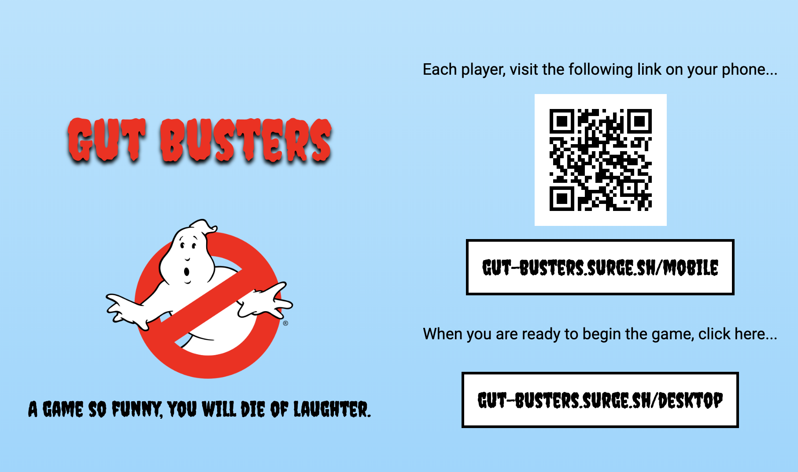
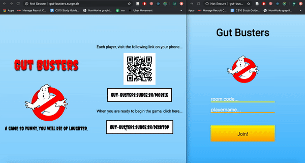
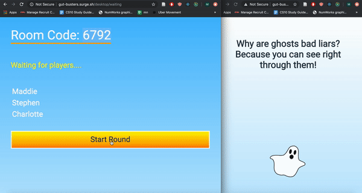

# Gut-Busters
## http://gut-busters.surge.sh

*In a world, where there weren't enough fun games, the Gut Busters team set off to build agame that is fun. Like, it's FUN. Seriously. The Quiplash-like game with more  a user input —— and therefore more fun!*

## Architecture

### Frontend
* React was used to build the User Interface for the app
* Redux states were used for functionality like fetchGame, setGame, and setVote
* Websocket connections used for mobile desktop communication for functions like createGame, joinGame, and submitVote
* SCSS used to style user interfaces
* Figma used for initial mockups and design stages

### Backend

*Read details in the API gitpage at https://github.com/dartmouth-cs52-19S/project-api-gut-busters*

* MongoDB as database for the app
* Express.js as server for the app
* Node.js is as our runtime environment for the app

## Gameplay

### Stage 1

#### Landing
First thing you see is this handy landing page shows three things
* provides an easy accsess QR code for players to join the game
* provides instructions for how to play the game for new players
* a little biography about the creation of the game by our lovley team

### Stage 2
From the links of the landing page you will be directed to the starting screen for the desktop and mobile pages shown below
Click start game whenever!
### Stage 3
Have players join the room with the uniquely generated code displayed on the desktop!
#### Desktop Waiting
Unique code on the upper left corner for players to enter.
Watch the users pop up like magic and click `Start Game` when all players have joined

#### Mobile Waiting
Enter in the room code and a username of your choice! Be creative.....but not too crazy! After you join the game you will see this waiting screen until all other players gave joined and the game has started. Enjoy the ghastly jokes while you're waiting :wink:

### Stage 4
Start playing! Answer the randomly generated questions!
#### Desktop Answering
The big screen will have simple instruction in case the intent of answering isn't clear
#### Mobile Answering
Quick, quick quick get those answers in before the timer runs out! Feel free to modify your answers if inspiration strikes a little later too!
You and one other player will be answering each question, and the questions are randomly distributed, so don't try cheating off your neighbor!
 

### Stage 5
Battle of the wit begins, vote for the best answer on the screen!
#### Desktop Vote
See the options that people are voting on and what your opponent came up with for each question.

After each question is voted for, see who pulled ahead of popular opinion with the results screen.

#### Mobile Vote
Voting begins! May the best answer win! Please know that you are also on a time limit, so make haste.

If you are a speedy voter, enjoy another joke while the other voters catch up.

If this is your answer, then you can't vote for yourself, that's cheating!
Sit tight while the other players decide your fate.

### Stage 6
See who came out on top with the final ranking.
#### Desktop Final
Moment of glory or stage of shame, see who had the wittiest, gut-busting answers.

#### Mobile Final
How'd you do? Rank number 1, or bottom of the barrel? Either way hope you had fun!

## Setup
:rocket: yarn to install and yarn start to run!
`!` remember to run both the client side and the server

## Deployment
* Deployed at (frontend) http://gut-busters.surge.sh/ and (backend) http://gut-busters.herokuapp.com/
* See http://gut-busters.surge.sh/desktop for landing desktop page
* See http://gut-busters.surge.sh/mobile for landing mobile page for each player

Have fun playing!

## Reflection

### What Worked
Our team was incredible. We all worked hard despite busy schedules to make meetings happen and work together when we could—especially when it came crunch time towards the final submission deadline!

The scope of the project was much larger than previously anticipated, but breaking down components and using both websockets and redux state made it possible to enact all the functionality we priviously planned.

That being said, we had an backend amazing team that figured out the functionality of websockets and timers which none of us had previous experience with prior to this project.

Creating a game, having semi-original branding, interesting gameplay and different algorithms based on number of players for scoring, answers and questions took a lot of planning and often involved hours not even typing a single line of code, but it did come together and we are so incredibly proud of this project that we’ve created! 

### What Didn't
While breaking into the front-end and back-end teams was a great way to start the planning and design of the project, we waiting too long to reconvene, which lead to miscommunication when connecting the front and back end. Practicing more partner coding would have helped this issue.

Testing was especially difficult since the need of multiple players to be recognized means testing it locally ran into problems with local storage which we used to keep track of player identity. This mean we had to take a complete compiling and deplyable object to run alot of testing.

Something that was difficult was planning meeting times. Everyone in the group is incredibly involved in so many other things on campus and/or had pre-existing commitments during times that other groups spent a lot of time working.

### Future Extensions Ideas
* Adding make your own question functionalities
* Adding more to the premade database of questions
* Having selectable themed premade databases of quesitons
* Single Player Mode

## Authors

Charlotte Chui,
Stephen Crowe,
Madison Hazard,
Madeline Hess,
Danielle Fang

## Acknowledgments
* https://medium.com/dailyjs/combining-react-with-socket-io-for-real-time-goodness-d26168429a34
* https://itnext.io/how-to-use-a-single-instance-of-socket-io-in-your-react-app-6a4465dcb398
* https://stackoverflow.com/questions/3458553/javascript-passing-parameters-to-a-callback-function
* https://medium.com/dailyjs/combining-react-with-socket-io-for-real-time-goodness-d26168429a34
* https://stackoverflow.com/questions/25500316/sort-a-dictionary-by-value-in-javascript

